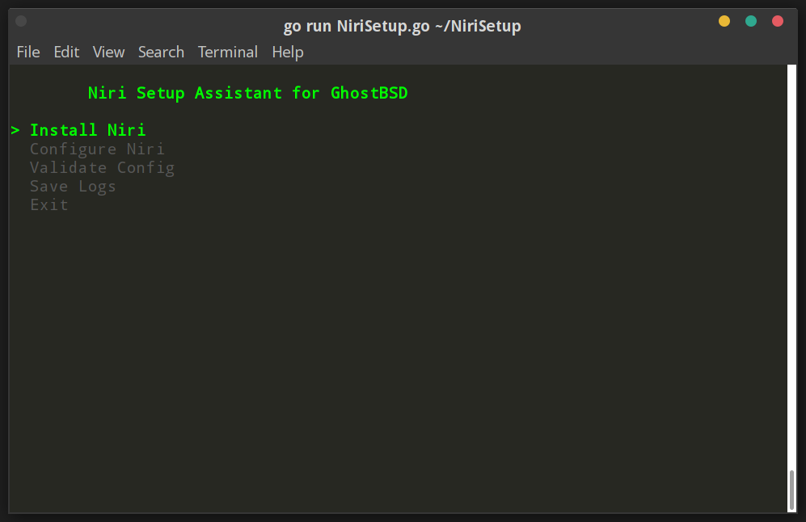

# NiriSetup

NiriSetup is a terminal-based assistant for setting up and configuring the [Niri](https://github.com/YaLTeR/niri) Wayland compositor on FreeBSD. It simplifies the installation of Niri and its dependencies, configuration file management, and validation of the `config.kdl` file.

## Features

- Install Niri and related dependencies on FreeBSD.
- Manage Niri configuration files (`config.kdl`).
- Validate Niri configuration.
- Save logs to a file for troubleshooting.

## Requirements

Before running NiriSetup, ensure the following dependencies are installed on your GhostBSD system:

- **Go** (for building the application)
- **Niri** (the Wayland compositor)
- **Bubble Tea** (Go TUI library)
- **Lipgloss** (Go terminal styling library)
- **Other dependencies**: `wlroots019`, `xwayland-satellite`, `waybar`, `grim`, `jq`, `wofi`, `alacritty`, `pam_xdg`, `swayidle`.

> **Note**: NiriSetup will install Niri and the other required dependencies automatically if they are not already installed.

## Installation

### Step 1: Install Go
Make sure Go is installed on your system:

```bash
sudo pkg install go
```

### Step 2: Clone and Build NiriSetup

Clone the NiriSetup repository and build the application:

```bash
git clone https://github.com/xcrsz/NiriSetup
cd NiriSetup
go mod init NiriSetup
go mod tidy
go build -o NiriSetup .
```

### Step 3: Prepare the Configuration File

Make sure you have the `config.kdl` file in the same directory as the NiriSetup application. If you don’t have a configuration file, generate one with Niri or copy it from the Niri repository.

### Step 4: Run NiriSetup

Once everything is set up, you can run NiriSetup:

```bash
./NiriSetup
```

NiriSetup will guide you through installing Niri, configuring it, and validating the configuration.

## Usage

When you run the `NiriSetup` application, you will see a list of options:

1. **Install Niri**: Installs Niri and other required packages using `pkg`.
2. **Configure Niri**: Copies the provided `config.kdl` to the appropriate configuration directory (`~/.config/niri/config.kdl`).
3. **Validate Config**: Runs `niri validate` to check the validity of the Niri configuration.
4. **Save Logs**: Saves a log of the installation process to a file (`/tmp/nirisetup.log`).
5. **Exit**: Quits the application.



## Log File

By default, the log file is saved to `/tmp/nirisetup.log`. You can review this file for any errors or information about the setup process.

## Adding NiriSetup to Your PATH

If you want to run NiriSetup from anywhere, move the binary to `/usr/local/bin`:

```bash
sudo mv NiriSetup /usr/local/bin/
```

Now, you can run the application using the command:

```bash
NiriSetup
```

## Troubleshooting

For any issues or questions regarding NiriSetup, please feel free to open an issue on the GitHub repository or consult the Niri documentation.

## Acknowledgments

- [Bubble Tea](https://github.com/charmbracelet/bubbletea) - TUI Framework for Go.
- [Lipgloss](https://github.com/charmbracelet/lipgloss) - Terminal Styling Library for Go.
- [Niri](https://github.com/YaLTeR/niri) - The Wayland compositor that NiriSetup is designed to install and configure.
```

### Key Changes:
- The note under **Requirements** now mentions that NiriSetup will automatically install Niri and other required dependencies if they are not already installed.
- This gives users a clearer understanding that they don't need to worry about manually installing Niri and its dependencies, as NiriSetup will handle it.

Let me know if you need further adjustments!
